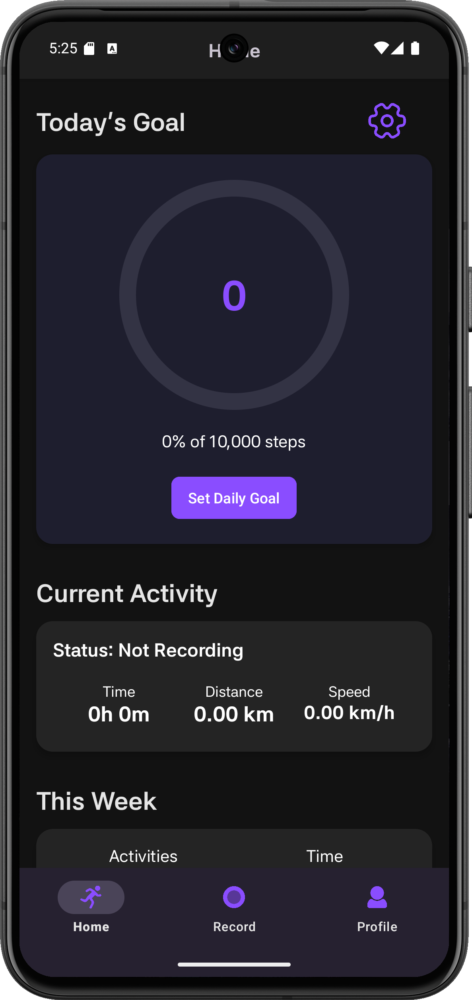

<p align="center">
  
</p>

<h1 align="center">StepSync</h1>

<p align="center">
  An Android fitness tracker for recording walks, tracking daily goals, and reviewing weekly progress.
</p>

<p align="center">
  
  
  
</p>

<p align="center">
  <a href="#features">Features</a> |
  <a href="#preview">Preview</a> |
  <a href="#setup">Setup</a> |
  <a href="#firebase">Firebase</a> |
  <a href="#verification">Verification</a>
</p>

## Preview

<p align="center">
  
</p>

## Spotlight: Power Saver Tracking

StepSync includes a Power Saver Tracking mode focused on reducing background tracking work while preserving step-count recording. On devices with Android's hardware step counter, the optimized path keeps pedometer-based tracking active while batching UI updates, throttling foreground notification refreshes, and using low-frequency sensor registration.

In a 30-minute background Android BatteryStats comparison, StepSync reduced app-attributed tracking CPU power from `1.17 mAh` to `0.248 mAh`, a `78.8%` reduction. The test compared the original hardware step-counter tracking loop against the optimized Power Saver path; it was not a GPS-vs-pedometer comparison.

```text
Baseline:  TYPE_STEP_COUNTER registered in the foreground service with a 1s Handler tick that rebroadcasts time, distance, speed, and steps.
Optimized: TYPE_STEP_COUNTER kept active, but the service batches UI broadcasts every 5s, refreshes the foreground notification every 15s, and registers the sensor at a 1,000,000us delay in Power Saver mode.
```

Detailed results are available in [docs/battery-results/comparison-20260530-30min.md](docs/battery-results/comparison-20260530-30min.md).

## Features

| Area | What StepSync Does |
| --- | --- |
| Account | Email/password sign up and login with Firebase Authentication |
| Tracking | Foreground step tracking service with start, pause, resume, and stop |
| Power | Adaptive sensor sampling with an in-app Power Saver Tracking mode |
| Goals | Daily step goal progress with configurable step length |
| Activity | Distance, duration, speed, pace, steps, and activity history |
| Units | Kilometer and mile display support |
| Insights | Weekly activity summary for recent progress |
| Profile | Username, avatar, and Firebase Auth password updates |
| Security | Realtime Database rules scoped to user-owned data |

## Tech Stack

| Layer | Tools |
| --- | --- |
| App | Kotlin, Android XML layouts |
| UI | AndroidX, Material Components, Navigation |
| Backend | Firebase Authentication, Firebase Realtime Database |
| Build | Gradle version catalog, Android Gradle Plugin |

## Setup

1. Open the project in Android Studio.
2. Use JDK 17 or the Android Studio bundled JDK.
3. Confirm `app/google-services.json` exists.
4. Sync Gradle.
5. Run the app on an emulator or Android device.

Recommended first test device:

```text
Pixel 8 - API 35 - Google Play
```

## Firebase

Firebase client config is handled by:

```text
app/google-services.json
```

That file contains client app identifiers and the Firebase Android API key. It is not an admin credential. Keep actual private secrets out of the repository:

- Firebase service account JSON
- Admin SDK private keys
- Release signing keys
- Keystore passwords
- `.env` files with private secrets

Realtime Database rules live here:

```text
rules/database-rules.json
```

Deploy rules:

```powershell
npx.cmd firebase-tools deploy --only database
```

## Verification

Run these checks before opening or updating a PR:

```powershell
.\gradlew.bat assembleDebug
.\gradlew.bat lintDebug
.\gradlew.bat testDebugUnitTest
```

## Documentation

- [Codebase standards](docs/codebase-standards.md)
- [Firebase CLI notes](docs/firebase-cli.md)
